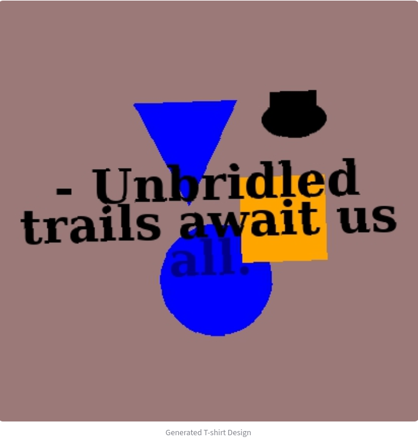

# TrendRunner Designer

**TrendRunner Designer** is an AI-powered app that creates stylish, on-trend running T-shirt designs — complete with unique slogans generated by a language model and layouts composed dynamically from keywords and icons.
It’s a lightweight example of a *Generative AI + Data Trends* pipeline built with free tools and open-source libraries.

---

## ✨ Key Features
---
* 🧠 LLM-powered slogan generation — creates short, catchy, keyword-relevant slogans for running enthusiasts.
* 📈 Google Trends integration — dynamically discovers trending fitness and running keywords.
* 🎨 AI-based image design — generates T-shirt mockups using keywords, slogans, and colors.
* ⚙️ Streamlit interface — fully interactive app for design tweaking (font size, color, icons).
* ☁️ Online or local LLM options — supports both OpenAI API and local models (Ollama + Llama 3).
* 💾 Fallback mechanisms — works even offline or when external services fail.
---

## 🧩 System Architecture

             ┌─────────────────────┐
             │ Google Trends (pytrends)
             └──────────┬──────────┘
                        │
        ┌───────────────▼────────────────┐
        │   update_keywords.py            │
        │   - Fetches or caches trending  │
        │     keywords in CSV format      │
        └───────────────┬────────────────┘
                        │
        ┌───────────────▼────────────────┐
        │   Streamlit App (app.py)        │
        │   - Reads keywords CSV          │
        │   - Lets user pick design opts  │
        │   - Calls LLM + image generator │
        └───────────────┬────────────────┘
                        │
        ┌───────────────▼────────────────┐
        │   llm_utils.py                 │
        │   - Online LLM (OpenAI)        │
        │   - Local fallback (Ollama)    │
        └───────────────┬────────────────┘
                        │
        ┌───────────────▼────────────────┐
        │   image_gen.py                 │
        │   - Composes design mockups    │
        │   - Saves to aux_files/        │
        └────────────────────────────────┘
---
## 🛠️ Tech Stack

| Component            | Description                                     |
| -------------------- | ----------------------------------------------- |
| **Python 3.12**      | Core programming language                       |
| **Streamlit**        | Interactive web app framework                   |
| **Pytrends**         | Google Trends pseudo-API                        |
| **OpenAI API**       | Online LLM (GPT-4o mini or similar)             |
| **Ollama**           | Local LLM backend (optional fallback)           |
| **Pandas**           | Data manipulation                               |
| **Pillow**           | Image composition and rendering                 |
| **Pathlib / Random** | Utility modules for file and randomness control |
---

## 🚀 How It Works
1. **Fetch trending keywords** using update_keywords.py (via Google Trends).
If Google API limits are reached, a fallback keyword list is used.
2. **Streamlit app loads** the keywords and presents adjustable design parameters (font size, icons, background).
3. When **“Generate Design”** is clicked:
   * A random keyword is chosen.
   * A slogan is generated using the online LLM (or a local fallback).
   * A T-shirt mockup image is created and displayed.
4. Designs are saved to aux_files/ and can be shared or reused.
---

## 💻 Running Locally

``` bash
# 1. Clone the repo
git clone https://github.com/yourusername/trendrunner_designer.git
cd trendrunner_designer

# 2. Create and activate environment
conda create -n trendrunner python=3.12
conda activate trendrunner

# 3. Install dependencies
pip install -r requirements.txt

# 4. (Optional) Set OpenAI key
export OPENAI_API_KEY="your_api_key_here"

# 5. Run the app
streamlit run app.py
```
Then open: http://localhost:8501

## 🌐 Cloud Deployment

You can deploy **TrendRunner Designer** on:

* Streamlit Community Cloud (free and easy)
* Hugging Face Spaces (Gradio/Streamlit support)
* Render or Railway (for persistent hosting)

Each option only needs:

* Your repo connected to GitHub
* requirements.txt
* app.py as the entry point

---
## 📂 Repository Structure
```
trendrunner_designer/
├── app.py
├── llm_utils.py
├── image_gen.py
├── update_keywords.py
├── data/
│   └── sample_keywords.csv
├── aux_files/
│   └── T-shirt_20251007.png
├── requirements.txt
└── README.md
```
---
## 🧠 Future Enhancements
* ✅ Add “Creativity” slider for LLM output control (tho, I kind of like the current 'AI clumsiness' of the slogans, it aligns well with the purpose of this project not actually being shirt printing).
* 🌍 Enable cloud-hosted model endpoint for broader access
* 🧾 Store user-created designs in an online gallery
* 💬 Add slogan rating & fine-tuning loop
---
## 📸 Demo

  <!-- optional screenshot -->
---

## 🪪 License

MIT License — free to use, modify, and share.